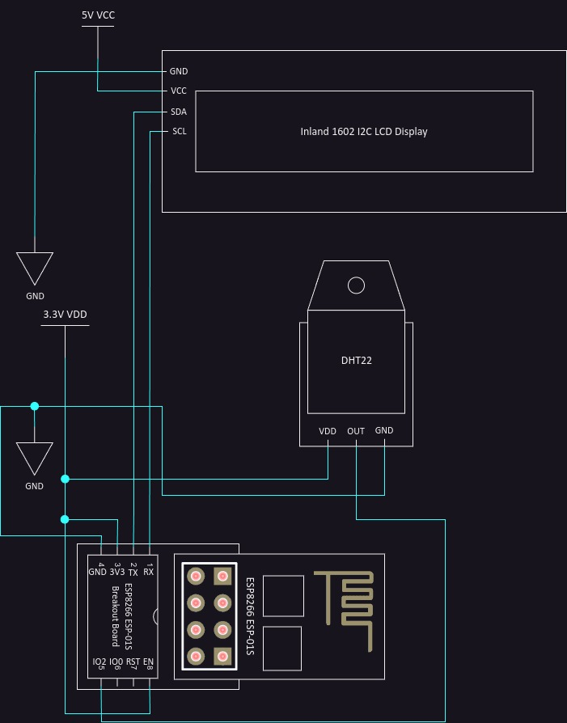
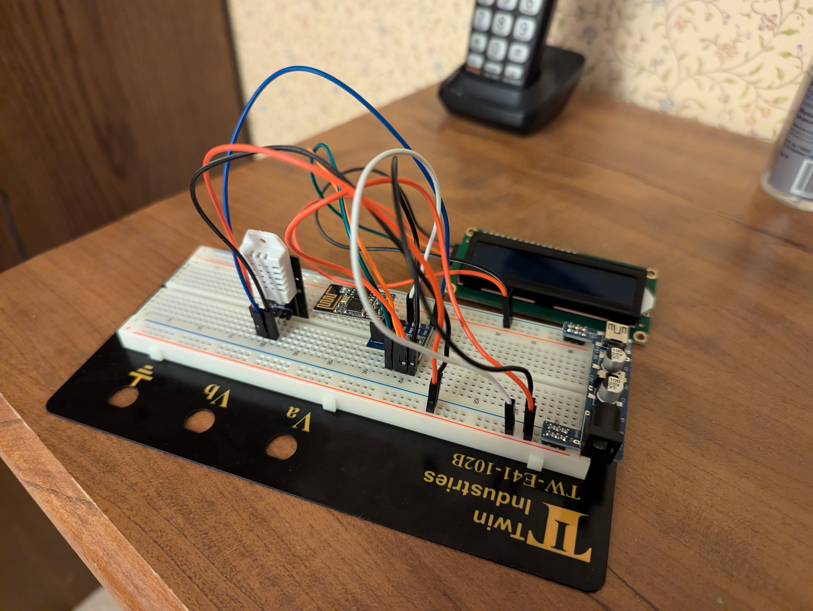
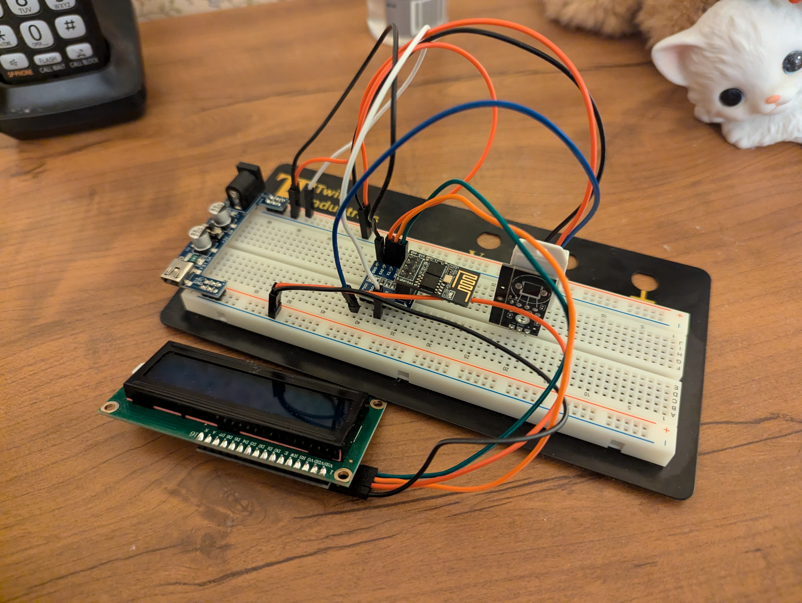
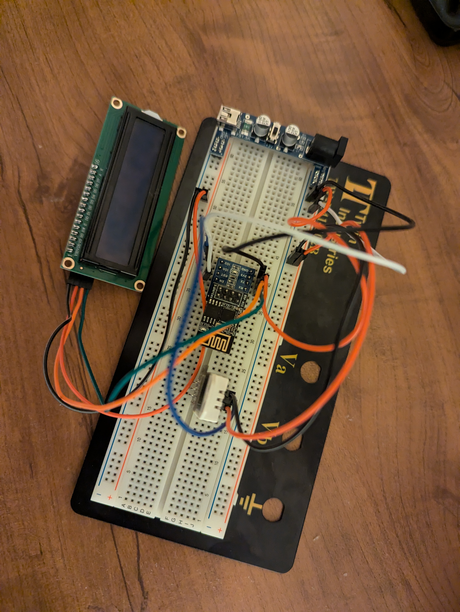
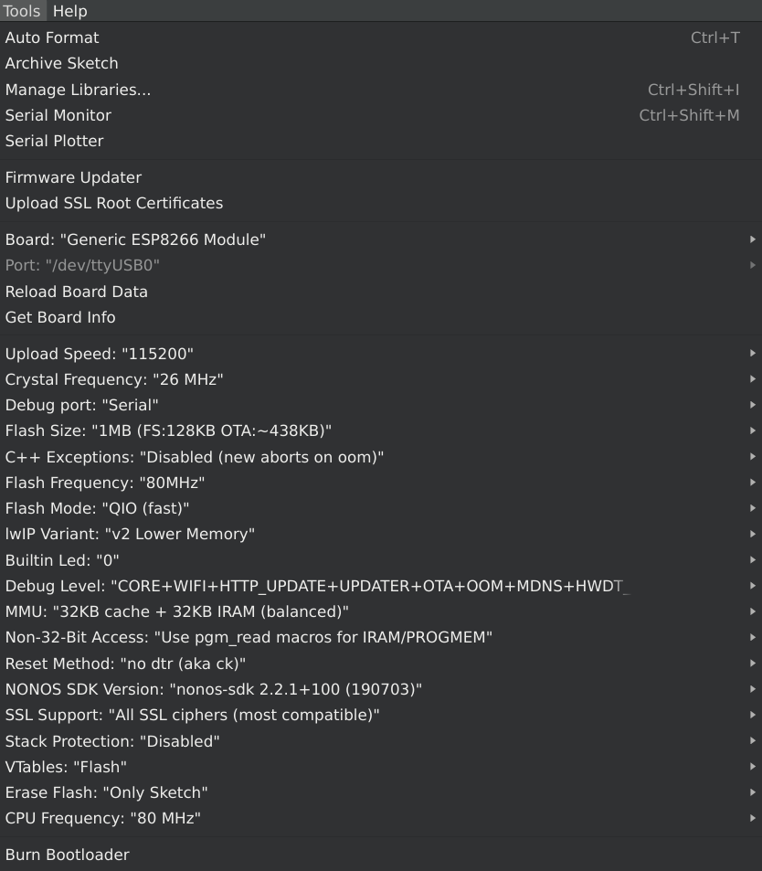

# Bill of Materials Used

Below is a list of components used in this project. The provided links are for convenience and reference; the author does not receive any commission from these links.

If you know of alternative sources or compatible products, especially drop-in replacements for Micro Center-exclusive items, contributions are welcome! You can create a pull request or open an issue ticket, and the author may incorporate the suggested changes into this README.

- [DHT22 AM2302 Temperature and Humidity Sensor (3-pack)](https://www.ebay.com/itm/285880858402)
- [Inland 1602 I2C LCD Display Module](https://www.microcenter.com/product/632704/inland-1602-i2c-lcd-display-module)
- [Inland Breadboard Power Supply Module (5V/3.3V)](https://www.ebay.com/itm/276578559475)
- [Inland Dupont Jumper Wires, 20cm (3-pack)](https://www.microcenter.com/product/613879/inland-dupont-jumper-wire-20cm-3-pack)
- [Inland ESP8266 Starter Kit](https://www.microcenter.com/product/617248/inland-esp8266-starter-kit)
- [Talentcell Rechargeable 12V 3000mAh Lithium ion Battery Pack (for powering the circuit)](https://www.amazon.com/gp/product/B01M7Z9Z1N/)
- [Twin Industries TW-E41-102B Breadboard](https://www.digikey.com/en/products/detail/twin-industries/TW-E41-102B/643113)

# Circuit Diagram and Real Life Photos of Circuit

## Circuit Diagram (Created Using draw.io)

## Real Life Photos of Circuit

# Board Manager URLs, Third-Party Libraries, Plugins, and Settings Used (for Arduino IDE)

## Board Manager URLs

- https://arduino.esp8266.com/stable/package_esp8266com_index.json

## Third-Party Libraries

- https://github.com/mathieucarbou/esphome-ESPAsyncTCP
    - If installing above dependency via git, make sure that the dependency gets git-cloned into a folder named "ESPAsyncTCP" without the quotes.
- https://github.com/mathieucarbou/ESPAsyncWebServer
- https://github.com/kohlerjl/ESP8266-I2C-LCD1602
    - If installing above dependency via git, make sure that the dependency gets git-cloned into a folder named "LiquidCrystal_I2C" without the quotes.
- https://github.com/adafruit/DHT-sensor-library

## Plugins

- https://github.com/earlephilhower/arduino-littlefs-upload
- https://github.com/dankeboy36/esp-exception-decoder (for debugging stack traces only)

## Settings Used

