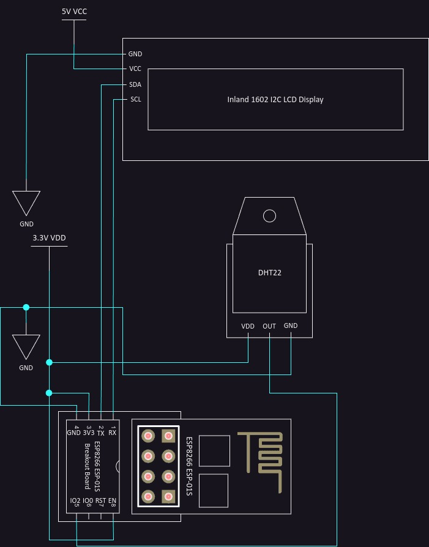
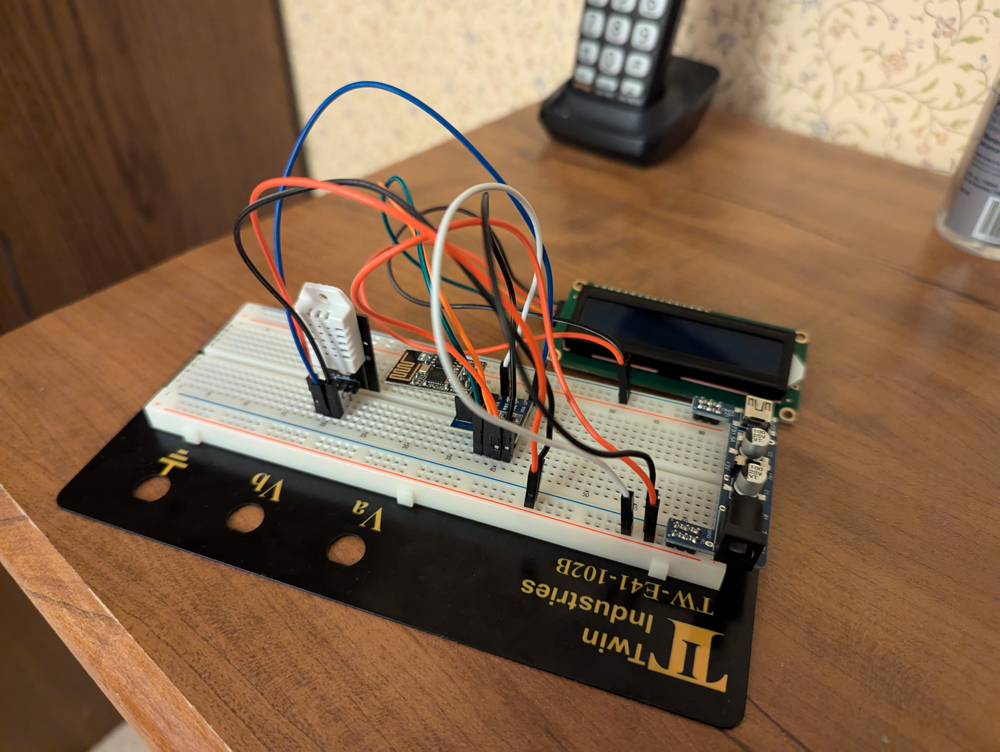
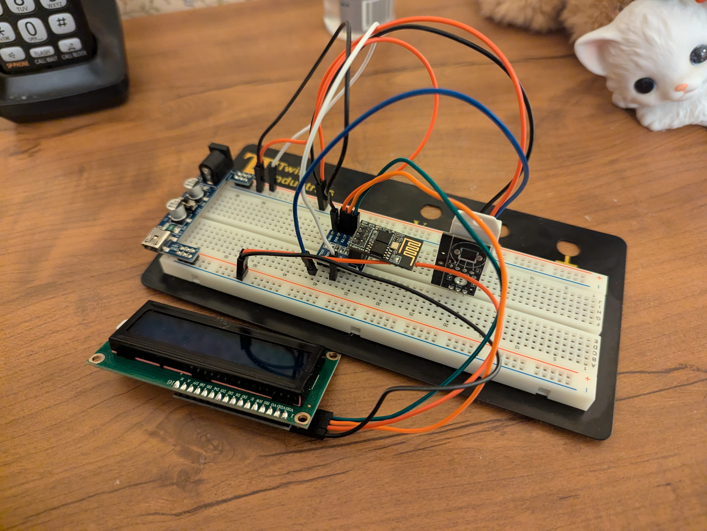
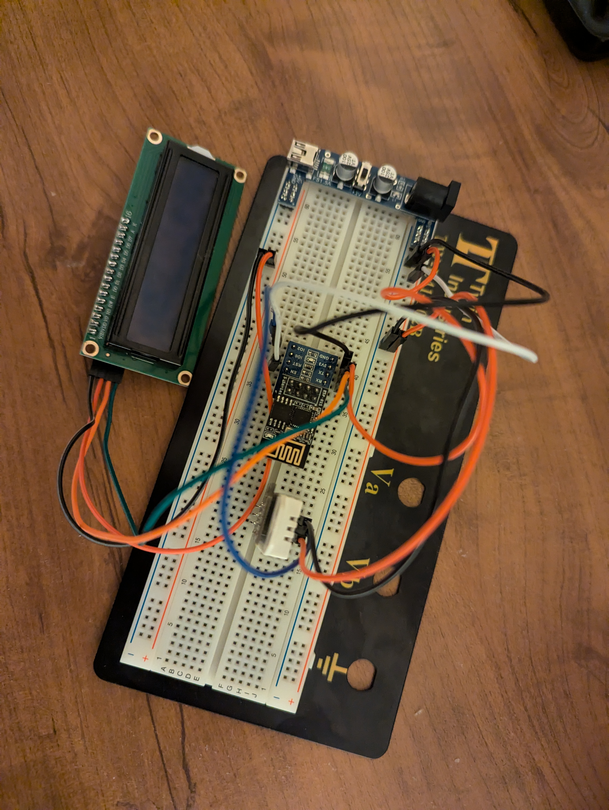

# Project Overview

This project is a simple circuit driven by a ESP8266 ESP-01S microcontroller which reports DHT22 temperature and humidity sensor readings via a web page over a local WiFi network.  The purpose of this project is to showcase my basic skills in microcontroller programming and circuits wiring.  This project uses code and inspiration taken from [this web page](https://randomnerdtutorials.com/esp8266-nodemcu-websocket-server-sensor/).

# Bill of Materials Used

Below is a list of components used in this project. The provided links are for convenience and reference; the author does not receive any commission from these links.

If you know of alternative sources or compatible products, especially drop-in replacements for Micro Center-exclusive items, contributions are welcome! You can create a pull request or open an issue ticket, and the author may incorporate the suggested changes into this README.

- [DHT22 AM2302 Temperature and Humidity Sensor (3-pack)](https://www.ebay.com/itm/285880858402)
- [Inland 1602 I2C LCD Display Module](https://www.microcenter.com/product/632704/inland-1602-i2c-lcd-display-module)
- [Inland Breadboard Power Supply Module (5V/3.3V)](https://www.ebay.com/itm/276578559475)
- [Inland Dupont Jumper Wires, 20cm (3-pack)](https://www.microcenter.com/product/613879/inland-dupont-jumper-wire-20cm-3-pack)
- [Inland ESP8266 Starter Kit](https://www.microcenter.com/product/617248/inland-esp8266-starter-kit)
- [Talentcell Rechargeable 12V 3000mAh Lithium ion Battery Pack (for powering the circuit)](https://www.amazon.com/gp/product/B01M7Z9Z1N/)
- [Twin Industries TW-E41-102B Breadboard](https://www.digikey.com/en/products/detail/twin-industries/TW-E41-102B/643113)

# Circuit Diagram and Real Life Photos of Circuit

## Circuit Diagram (Created Using draw.io)



## Real Life Photos of Circuit







# Board Manager URLs, Third-Party Libraries, Plugins, and Settings Used (for Arduino IDE)

## Board Manager URLs

- https://arduino.esp8266.com/stable/package_esp8266com_index.json

## Third-Party Libraries

- https://github.com/mathieucarbou/esphome-ESPAsyncTCP/releases
    - requires manual installation via ZIP file
- https://github.com/mathieucarbou/ESPAsyncWebServer
- https://github.com/kohlerjl/ESP8266-I2C-LCD1602
    - requires manual installation via ZIP file
- https://github.com/adafruit/DHT-sensor-library

## Plugins

- https://github.com/earlephilhower/arduino-littlefs-upload
- https://github.com/dankeboy36/esp-exception-decoder (for debugging stack traces only)

## Settings Used


# Instructions for Running This Project

1. **Construct the Circuit**  
   Gather all materials listed in the [Bill of Materials Used](#bill-of-materials-used) section. Assemble the circuit following the [circuit diagram](#circuit-diagram-created-using-drawio).  
   **Important**: Ensure the ground wire connecting the LCD I2C display to ground is connected to the ground pin on the power module next to the 5V VCC output, not the 3.3V VDD output.

2. **Set Up the Arduino IDE**  
   Install the [Arduino IDE](https://www.arduino.cc/en/software) if not already installed. Configure the IDE as detailed in the [Board Manager URLs, Third-Party Libraries, Plugins, and Settings Used](#board-manager-urls-third-party-libraries-plugins-and-settings-used-for-arduino-ide) by:
    - Adding the board manager URL.
    - Installing the required third-party libraries and plugins.
    - Adjusting the board settings.

3. **Upload the LittleFS Filesystem**  

    - Remove the ESP8266 ESP-01S module from the circuit constructed in Step 1, insert it into a USB programmer, and connect it to your computer.
    - Open the sketch from this repository in the Arduino IDE.
    - Press `CTRL + Shift + P` in the Arduino IDE, type "LittleFS," and select the option to upload a LittleFS filesystem.
    - Upload the contents of the [`data`](./data) directory to the ESP-01S module as a LittleFS filesystem.

4. **Create a `WiFiSecrets.h` File**  
   In the same directory as this README, create a file named `WiFiSecrets.h` with the following content, replacing the placeholders with your WiFi credentials:
```cpp

#ifndef WIFISECRETS_H_
#define WIFISECRETS_H_

const char* ssid = "your-ssid-here";
const char* password = "your-wifi-password-here";

#endif

```

5. **Upload the Sketch**  
    - Unplug and replug the programmer along with the ESP-01S module back into your computer
    - Compile and upload the sketch from this repository to the ESP-01S module

6. **Reconnect the ESP-01S to the Circuit**  
    - Unplug the USB programmer from your computer, remove the ESP-01S module, and reinsert it into the circuit constructed in Step 1.
    - Ensure the circuit is powered off during this process, then power it back on.

7. **Access the Sensor Readings**  
   Once powered on, an IP address will be displayed on the LCD screen. Open this IP address in a web browser on a device connected to the same WiFi network to view the DHT22 sensor readings.  
   **Note**: The web interface is accessible only on your local WiFi network.

# Troubleshooting

- Issue: web page of IP address mentioned in step 7 in [Instructions for Running This Project](#instructions-for-running-this-project) displays sensor values each as `nan`.
    - Solution: power off the circuit and then power it back on